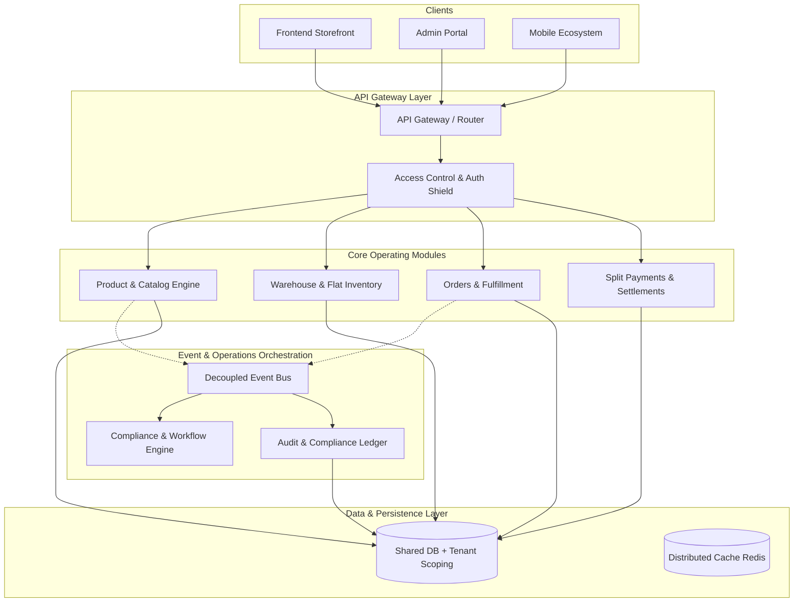

# 🏰 Amrit Rasoi Enterprise-Grade Commerce OS Blueprint

This document delineates the master architectural blueprint for transitioning the **Amrit Rasoi** platform into a highly scalable, multi-tenant digital commerce operating system.



---

## 1. Multi-Tenant Architecture & Database Isolation Layer

To support both **Single-Brand Operations** and a **Multi-Vendor Marketplace Franchise** without architectural leaks, Amrit Rasoi implements a **Shared Database + Logical Tenant Isolation Strategy**.

### Logical Database Isolation Matrix
Every document within critical collections (`Product`, `Order`, `Inventory`, `Review`, `AuditLog`) is bound by a strict logical hierarchy:

* **`tenantId` / `collaborationId`:** Links the resource specifically to an authorized collaboration partner storefront.
* **`organizationId`:** Groups multiple partner storefronts under regional or franchise umbrellas.

### Code Pattern: The Automatic Partner Scoping Middleware
```javascript
// backend/middleware/partnerScope.js
exports.scopePartnerCatalog = (req, res, next) => {
  if (req.user && req.user.role === 'partner_admin' && req.user.collaboration) {
    req.query.collaboration = req.user.collaboration.toString();
  }
  next();
};
```
* **Database Guard Enforcement:** Queries dynamically apply the `collaboration` ID constraint when compiling operations for `partner_admin` channels, eliminating any threat of cross-tenant data leakage.

---

## 2. Dynamic Permission & Access Control Internals

The platform uses a hybrid **RBAC (Role-Based Access Control) + ABAC (Attribute-Based Access Control)** engine to guard resources dynamically.

### Role Hierarchy Mapping
```
┌──────────────────────────────────────────────────────────┐
│                      Super Admin                         │
│             (Global Platform Configuration)              │
└────────────────────────────┬─────────────────────────────┘
                             │
            ┌────────────────┴────────────────┐
            ▼                                 ▼
┌───────────────────────┐         ┌───────────────────────┐
│   Internal Company    │         │  Brand Collaborator   │
│     Staff Roles       │         │        Portal         │
│(Inventory, Orders Desk)│         │   (partner_admin)     │
└───────────────────────┘         └───────────────────────┘
```

### Actionable Endpoint Guards
Endpoints are double-shielded dynamically using `isAuthenticatedUser`, `authorizeRoles`, and the modular `authorizePermissions` matrix:

```javascript
router.put('/product/:id', authorizePermissions('manageProducts'), upload.any(), updateProduct);
router.get('/inventory', scopePartnerCatalog, authorizePermissions('manageInventory'), getInventory);
```

---

## 3. Decoupled System Event Bus & Core Workflows

The platform leverages an asynchronous **EventEmitter System Event Bus** under `backend/utils/eventBus.js`. This allows developers to hook in new features (such as ERP integrations or AI recommendation modules) without modifying primary transaction controllers.

### Core Decoupled Pipeline
```
[OrderPlaced Event] 
        │
        ├──► Deduce Inventory Stock levels dynamically
        ├──► Compile & Send Whatsapp / Email invoices
        ├──► Queue Delivery logistics assignments
        └──► Log audit trials to Compliance Ledger (Async)
```

---

## 4. Logistics, Warehouse, and Origin Orchestration

Amrit Rasoi operates with its primary production hub located in **Sikar, Rajasthan**, utilizing dynamic logistics calculation bands.

### Shipping Speeds & Origin Metrics
* **Origin Hub:** Sikar, Rajasthan.
* **Shipping Calculations (Local vs. National):**
  * **Local Band (Rajasthan):** Delivered within **1–2 days**.
  * **Regional Band (Delhi, Haryana, UP, MP, Punjab):** Delivered within **2–3 days**.
  * **National Band (Rest of India):** Delivered within **4–5 days**.
* **Logistics Orchestration:** Dynamically configured using automated calculations based on customer postal address codes, providing buyers with high-accuracy transit expectations during checkout.

---

## 5. Observable Audits & Feature Flags System

### The Compliance Audit Ledger
Every critical system mutation (price updates, permissions grants, product deletions, administrative logins) writes an immutable compliance trail via `backend/models/AuditLog.js` displaying:
* Actor name and role context.
* IP Address & User Agent metadata.
* Full previous state vs new state JSON diff visualization.

### Run-Time Feature Flags
Supports safe canary rollouts and A/B checkout tests through `FeatureFlag.js` schemas, enabling/disabling system modules (like AI Search or splits payouts) on-the-fly without codebase deployments.

---

## 6. High-Scalability Infrastructure & Microservices Roadmap

To support scaling from a single instance to a global enterprise commerce operating system, we outline the following migration strategy:

### Infrastructure Architecture Phase-out

```
[Phase 1: Shared Monolith] ─────► [Phase 2: Decoupled Services] ─────► [Phase 3: Kubernetes Microservices]
   (Current node/express)              (Redis cache + split workers)             (Independent service pods)
```

1. **Caching Layer:** Integrate distributed **Redis caching** for hot catalog paths and user session states to minimize primary database load.
2. **Containerization & Orchestration:** Package system modules into Docker containers, orchestrating them using **Kubernetes** to automatically auto-scale pods under spikes.
3. **API Gateway:** Implement an API Gateway (e.g. Kong, AWS API Gateway) to handle rate-limiting, CORS, and token authentication at the edge before hitting core service pools.
